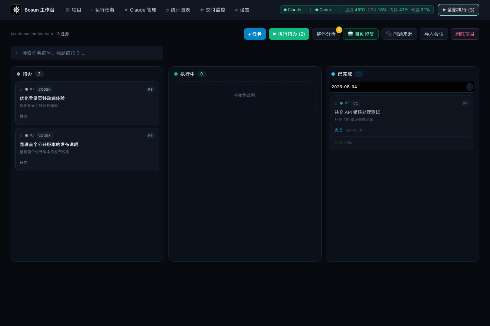
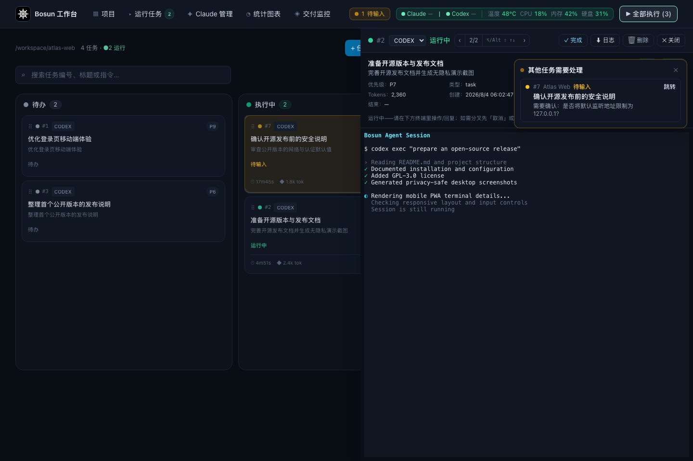
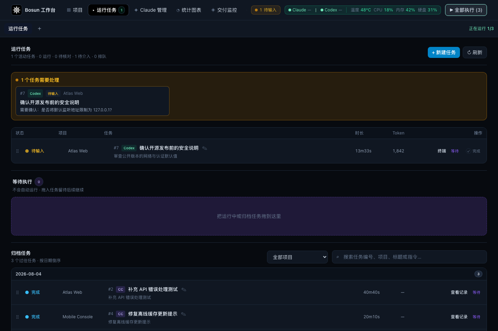
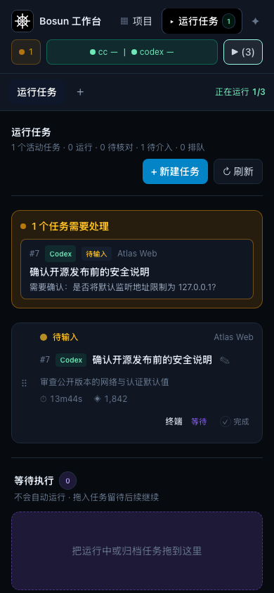
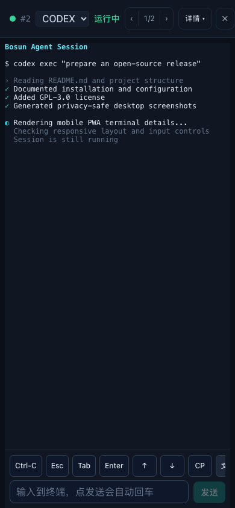
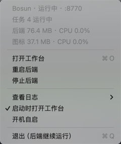

# ⚓ Bosun · Claude Code / Codex 工作台

Bosun 是一个本地优先的 Web 工作台，用来扫描和管理本机多个项目，并通过可交互终端会话编排 Claude Code / Codex 执行开发任务。

它提供并发上限、优先级调度、任务状态跟踪、人在环的 AI 诊断，以及跨项目的数据统计。设计思路见 [`docs/bosun-design.md`](docs/bosun-design.md)。

> [!WARNING]
> Bosun 可以驱动本机终端并访问已导入的代码仓库。服务默认监听 `0.0.0.0`，首次启动后请立即在「设置 → 访问控制」中设置强口令，或通过 `BOSUN_PASSWORD` 配置。请勿在未配置访问控制和 HTTPS 反向代理的情况下暴露到公网。

## 核心能力

- 扫描本机目录并集中管理多个项目
- 在 Claude Code、Codex、Oh My Pi 和 Kimi Code 之间选择执行引擎，创建、排队和接续任务
- 通过优先级与并发上限自动调度任务
- 在浏览器中查看实时终端、输入指令并接管会话
- 汇总问题、任务趋势、引擎用量与复盘数据
- 将诊断结果转成修复任务，关键决策保留人工确认
- 提供适合手机访问的 PWA，以及可选的 macOS 菜单栏应用

## 界面预览

### 项目任务看板



### 交互终端



### 等待用户介入



### 手机 PWA

| 任务操作 | 终端详情 |
| --- | --- |
|  |  |

_以上截图使用完全虚构的项目、路径、任务、终端输出和系统指标，不包含真实用户数据。_

## 快速开始

### 环境要求

- macOS 或 Linux
- Python 3.10+
- Node.js 18+ 与 npm
- Git
- 已安装并登录 `claude`（Claude Code）和/或 `codex` CLI，且命令位于 `PATH` 中
- 可选：`omp`（[Oh My Pi](https://github.com/can1357/oh-my-pi)，`npm i -g @oh-my-pi/pi-coding-agent`）。它自带 provider 凭据、依赖 Bun 运行时，安装体积约 1.1 GB；Bosun 不为它做订阅额度查询
- 可选：`kimi`（[Kimi Code CLI](https://github.com/MoonshotAI/kimi-code)，`curl -fsSL https://code.kimi.com/kimi-code/install.sh | bash` 或 `npm i -g @moonshot-ai/kimi-code`）。注意 npm 上的裸 `kimi-cli` 是不相干的占名包；旧一代 PyPI 版 kimi-cli 已进入淘汰期，Bosun 只适配新版 kimi-code。它自带 provider 凭据，Bosun 不为它做订阅额度查询

### 安装

```bash
git clone https://github.com/thsrite/bosun.git
cd bosun

python3 -m venv backend/.venv
backend/.venv/bin/pip install -r backend/requirements.txt

cd frontend
npm install
cd ..
```

### 一键启动（推荐）

```bash
./start.sh            # 开发模式：后端 + Vite dev server（前端热更新）
./start.sh --prod     # 生产模式：先构建前端产物，只起后端托管 dist
```

开发模式会清理占用 `8770` / `5199` 的旧进程并启动前后端。前端监听 `0.0.0.0:5199`，同一局域网设备可通过脚本输出的局域网地址访问。按 `Ctrl+C` 会同时停止前后端。

生产模式先跑 `npm run build`，只启动后端并由它托管 `frontend/dist`，仅占用 `8770`；手机/PWA 直接访问后端端口即可，不再走 Vite dev，避免总是热重载。

### macOS 状态栏常驻（免终端）

```bash
cd frontend && npm run build    # 生产模式需要先有 frontend/dist
./macos/build.sh --install      # 构建 Bosun.app 并安装到 /Applications
```

菜单栏出现 ⛵ 图标即成功：实心 = 运行中，空心 = 已停止。菜单提供打开工作台、启动/重启/停止后端、查看日志，以及两个开关。



**启动时打开工作台（默认开启）**：打开 Bosun.app 后会等后端健康检查通过（最多等 20 秒，避免白屏），再自动拉起已安装的 PWA「Bosun 工作台」，省掉手动点一次。找不到 PWA 时退回默认浏览器打开 `http://127.0.0.1:8770`。不需要可在菜单里关掉。

菜单顶部实时显示运行中的任务数，以及后端与图标进程各自的内存和 CPU 占用。采样走 `proc_pid_rusage` 系统调用而非 `ps`，不派生子进程；任务数由 `/api/health` 提供，该字段**只回给 127.0.0.1**，不会经局域网泄露（该端点免鉴权，而后端默认监听 `0.0.0.0`）。

**开机自启默认关闭**：装好后打开 Bosun.app 才会拉起后端，重启电脑不会自动运行。需要的话在菜单里勾选「开机自启」，下次登录起生效。

后端由 launchd（`com.thsrite.bosun.backend`）持有而非图标进程持有，因此退出图标不会中断在途任务；崩溃会被自动拉起，并有 10 秒节流防止重启风暴。若 `8770` 已被手工运行的 `start.sh` 占用，图标会识别并跳过接管，不会抢端口。

只依赖 Xcode Command Line Tools，无需完整 Xcode。日志在 `~/Library/Logs/bosun.{out,err}.log`。

完全卸载：

```bash
launchctl bootout gui/$(id -u)/com.thsrite.bosun.backend 2>/dev/null
rm -f ~/Library/LaunchAgents/com.thsrite.bosun.*.plist
pkill -x Bosun; rm -rf /Applications/Bosun.app
```

### 手动启动

#### 后端

```bash
cd backend
python3 -m venv .venv
.venv/bin/pip install -r requirements.txt
.venv/bin/python run.py        # 监听 127.0.0.1:8770
```

#### 前端（开发）

```bash
cd frontend
npm install
npm run dev                     # 打开 http://localhost:5199
```

#### 前端（生产，随后端一起服务）

```bash
cd frontend && npm run build    # 产物在 frontend/dist
# 之后访问后端 http://127.0.0.1:8770 即为完整应用
```

## 更新

「设置 → Bosun 版本」可以对比本地版本与 GitHub 上最新的 [release](https://github.com/thsrite/bosun/releases)，并一键更新本地代码：

1. `git fetch --tags` 后快进合并到该 release 的 tag（不做 merge，也不会 reset）
2. 按本次变更的文件决定是否重装后端依赖、前端依赖、重建 `frontend/dist`
3. 由 Bosun.app 托管的后端会自动重启；`start.sh` 启动的后端需要自己重启

以下情况会拒绝更新，交由你自己处理，不会覆盖本地内容：

- 工作区有未提交改动
- 本地存在该 release 之外的提交（无法快进）
- 当前部署不是 git 工作区（例如直接下载的源码包）

发版时需要同步更新 `backend/app/version.py` 的 `VERSION`、`frontend/package.json` 的 `version`，并打上同名 tag（`vX.Y.Z`）；三者不一致会导致版本比对失真。

## 用法

1. 右上「+ 项目 / 扫描」→ 填一个根目录扫描导入，或手动加单个仓库
2. 项目泳道里「+ 任务」→ 选 cc/codex/omp/kimi + 写指令 + 优先级 → 自动进调度
3. 点任务卡「终端」→ 右侧实时终端，可打字插手
4. 拖拽任务卡改优先级；顶栏调并发上限
5. 「整体分析」→ 问题收件箱 → 勾「→ 修复任务」转成修复任务（人在环）
6. 「统计」看任务趋势 / 引擎用量 / 问题态势

选用 omp 时，「设置 → Oh My Pi」可以填模型与思考档位；选用 kimi 时，「设置 → Kimi Code」可以选模型别名（列表来自 `~/.kimi-code/config.toml`）。设置页按引擎分卡：已安装的引擎卡头显示版本，未安装的显示灰态占位卡（含安装命令），全部支持的 CLI 与本机安装状态一目了然。

## 配置

| 环境变量 | 默认值 | 用途 |
| --- | --- | --- |
| `BOSUN_DATA` | `~/.bosun` | SQLite 数据库与运行日志目录 |
| `BOSUN_HOST` | `0.0.0.0` | 后端监听地址 |
| `BOSUN_PORT` | `8770` | 后端端口 |
| `BOSUN_PASSWORD` | 未设置 | 访问口令；设置后会覆盖设置页中保存的口令 |
| `BOSUN_BACKEND_PORT` | `8770` | `start.sh` 使用的后端端口 |
| `BOSUN_FRONTEND_PORT` | `5199` | `start.sh` 开发模式使用的前端端口 |
| `BOSUN_CLAUDE_BIN` | 自动探测 `claude` | Claude Code 可执行文件路径 |
| `BOSUN_CODEX_BIN` | 自动探测 `codex` | Codex CLI 可执行文件路径 |
| `BOSUN_OMP_BIN` | 自动探测 `omp` | Oh My Pi 可执行文件路径 |
| `BOSUN_KIMI_BIN` | 自动探测 `kimi` | Kimi Code CLI 可执行文件路径 |

默认数据保存在 `~/.bosun/`。升级或迁移前，建议先备份该目录。

## 安全说明

- Bosun 会继承本机 Claude Code / Codex / Oh My Pi / Kimi Code 的登录状态和文件访问能力，请只导入可信仓库。
- Oh My Pi 启动时会自动读取 `~/.claude` 下的配置，包括已配置的 MCP server 和 skills；不希望它接触这些资源时，不要选用该引擎。
- 未设置访问口令时，任何能访问服务的人都可能操作任务和终端；局域网环境也不应视为安全边界。
- 若需跨设备访问，至少启用强口令；若需公网访问，请额外使用 HTTPS、可信反向代理和网络访问控制。
- 不要把 API Key、访问令牌、数据库或 `~/.bosun/` 中的运行数据提交到 Git。

## 项目结构

```text
backend/        FastAPI 后端、调度器、终端会话与 SQLite 数据层
frontend/       React + TypeScript + Vite 前端
macos/          macOS 菜单栏应用及构建脚本
bosun_skills/   随项目提供的 Bosun agent skills
docs/           设计文档与功能规格
```

## 开发与验证

```bash
# 后端语法检查
backend/.venv/bin/python -m compileall -q backend/app

# 前端类型检查与生产构建
cd frontend && npm run build
```

提交改动前，请至少运行与改动范围对应的检查和前端构建。

## 参与贡献

欢迎提交 Issue 和 Pull Request。请在 PR 中说明改动目的、验证命令与结果；行为变更和缺陷修复应同时提供对应测试。安全问题请不要公开披露利用细节，先通过仓库维护者的私密联系方式报告。

## 开源许可

Bosun 采用 [GNU General Public License v3.0](LICENSE)（`GPL-3.0-only`）开源。你可以使用、修改和分发本项目；分发本项目或其衍生作品时，需要遵守 GPL v3 的源代码开放及同许可证分发要求。
